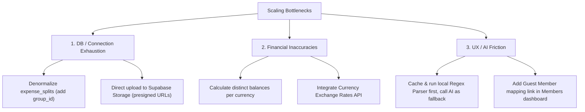

# Analysis of Clear: Architecture, Roadmap, and Scale/UX Failure Modes

This document provides a comprehensive audit of the **Clear** expense tracking application. It examines the technical architecture, product design choices, competitive positioning, and potential failure modes that could hinder scale, performance, or user satisfaction.

---

## 1. Architectural & Technical Profile

Clear is structured as a modern, high-performance web application designed to be installable (PWA) and responsive, with a premium glassmorphic visual aesthetic.

### Core Tech Stack
*   **Framework**: Next.js 16 (App Router) using React Server Components (RSC) by default for pages and Server Actions for all data mutations.
*   **Database**: Supabase Postgres exposed through Drizzle ORM (v0.43) for database operations, and the Supabase Client SDK for authentication and real-time syncing.
*   **Styling & UI**: Tailwind CSS v4 (CSS-first, config-free) styled with `@base-ui/react` (Base UI instead of Radix UI) for headless UI components.
*   **AI Integration**: Anthropic Claude Haiku (`claude-haiku-4-5-20251001`) via the Server Actions layer for processing natural language expense entries, chat transcripts, and trip summaries.
*   **Realtime**: Supabase Postgres changes listener (production only).

---

## 2. Competitive Landscape & Strategic Rebrand

The app was rebranded from **Wayfare** (a travel-specific splitter) to **Clear** to generalise and target a broader audience, competing directly with incumbent giants:
*   **Splitwise** (50M+ users): The dominant market leader, but currently criticized for stagnant UX, heavy ads, paywalled basic features (like currency conversion and receipts), and weak recurring expense management.
*   **Tricount & Settle Up**: Strong in Europe, but feature-static and UI-heavy.

### Value Proposition of Clear
1.  **Dual Mode**: Two distinct group configurations (`lib/group-config.ts`):
    *   **Trip Mode**: Multi-day trip tracking with dates, budget bars, travel categories, trip plan parsing, and AI-generated narratives.
    *   **Nest Mode**: Ongoing household expense management with recurring templates, monthly context, and household-specific categories.
2.  **Premium UX**: Immersive glassmorphic layouts, dark mode, smooth Framer Motion animations, and a guided 10-step onboarding tour.
3.  **AI-First Input**: Quick-add bar parses a single natural language string (e.g. *"Lunch 1200 Karthik paid split 3"*) to populate complex expense split models automatically.

---

## 3. Scale and Performance Bottlenecks

While the codebase is exceptionally clean and well-structured, several technical designs present high risks of failure under scale.

### 🚨 1. Realtime Broadcast Storm (O(N²) Database Refreshes)
In [use-trip-realtime.ts](file:///E:/Projects/Clear/hooks/use-trip-realtime.ts#L38-L41), the Postgres real-time channel listens broadly to changes on the `expense_splits` table:
```typescript
.on("postgres_changes", {
  event: "*", schema: "public", table: "expense_splits",
}, debouncedRefresh)
```
*   **The Issue**: Unlike `expenses` and `settlements` which are filtered by `group_id=eq.${groupId}`, the `expense_splits` table does not have a `group_id` column. Therefore, **every active client across the entire platform** will receive a real-time event for *any* database modification in the `expense_splits` table, regardless of which group they belong to.
*   **The Impact**: As concurrent users grow, a single user adding an expense in Group A will trigger a Postgres change event to thousands of active clients in Groups B, C, D, etc. Each of these clients will immediately invoke `router.refresh()`, making multiple server-side requests to fetch group data and balances. This creates a severe denial-of-service (DoS) loop on the database.

### 🚨 2. Supabase Free-Tier Connection and CPU Exhaustion
*   **The Issue**: Supabase's free tier has a strict limit of 60 concurrent database connections and low CPU allocations. Next.js server actions and API routes spawn serverless instances that scale horizontally. 
*   **The Impact**: Even with the connection pooler and a DB singleton setting `max: 3` connections, a brief surge in traffic (or the Realtime storm described above) will quickly saturate the connection limits, returning `54000: connection limit exceeded` to active users. The team's decision to disable Realtime in development because it consumed 85% of CPU points to a fundamental inefficiency in how Realtime events map to Next.js page refreshes.

### 🚨 3. Next.js Server Action Payload Limits (Base64 Uploads)
*   **The Issue**: In [upload.ts](file:///E:/Projects/Clear/app/actions/upload.ts) (for cover photos) and [parse-itinerary.ts](file:///E:/Projects/Clear/app/actions/parse-itinerary.ts) (for PDF itineraries), files are sent as Base64 strings inside Server Action arguments.
*   **The Impact**: Base64 encoding increases data size by roughly 33%. Vercel imposes a strict **4.5 MB request payload limit** for serverless function bodies. If a user uploads a 4 MB camera photo or a large PDF itinerary, the Base64 representation will exceed 5.3 MB, causing Vercel to abort the request with a `413 Payload Too Large` error, which crashes the UI without a clear explanation to the user.

---

## 4. Product, UX, & Financial Correctness Flaws

Beyond technical scaling, several product implementation details could negatively impact user trust and adoption.

### 🚨 1. Multi-Currency Split Corruption (Critical)
The app supports 9 different currencies (`lib/utils.ts`): `INR`, `USD`, `EUR`, `GBP`, `SGD`, `AED`, `JPY`, `CAD`, and `AUD`.
*   **The Issue**: In [balances.ts](file:///E:/Projects/Clear/lib/db/queries/balances.ts#L22-L34), paid and owed totals are flat-summed directly in the SQL query across all expenses:
    ```sql
    sum(expenses.amount).as('paid_total')
    ```
*   **The Impact**: If a group's default currency is `INR`, and a member logs an expense of `$50 USD` alongside another member's expense of `₹500 INR`, the database sums them as `50 + 500 = 550` units. The app then displays the total as `₹550 INR`. B's $50 payment is drastically undervalued, corrupting the debt settlement logic.
*   **Why it fails**: Incumbent apps handle multiple currencies by maintaining distinct balances per currency (Splitwise) or converting values on-the-fly using current exchange rates. Clear does neither, making its multi-currency feature a high risk for user financial errors.

### 🚨 2. AI Prompt and Cost Latency Bottlenecks
*   **The Issue**: Clear relies on Claude Haiku (`claude-haiku-4-5-20251001`) to parse inputs, create summaries, and analyze itineraries.
*   **The Impact**:
    *   **Latency**: AI parsing in the Quick-add bar has a 6-second timeout wrapper. In production, Anthropic API calls can take 1.5 to 3 seconds. For a feature meant to be "one-tap", waiting for an LLM round-trip makes the app feel slower than filling out a basic form.
    *   **Cost Scaling**: Every single quick-add keystroke or voice utterance parsed by the AI calls the Claude API. If the app scales to millions of entries, the API token costs will become unsustainable, especially for a free-tier app.
    *   **Friction**: Voice-to-text relies on the browser's `WebSpeech API`, which has poor accuracy for accented speech or noisy environments, causing the AI parser to hallucinate names or numbers.

### 🚨 3. Invitation and Onboarding Friction
*   **The Issue**: Inviting a member generates a direct join URL (`/join/[shareToken]`). However, if the invited user is not logged in, they must undergo Google OAuth signup first.
*   **The Impact**: Once authenticated, if the app fails to preserve the initial `/join/[shareToken]` redirect context (e.g. due to state loss during OAuth callback redirect), the user is dropped onto the dashboard instead of joining the group. They are forced to click the link a second time, creating onboarding drop-offs.
*   **Guest Member Orphanage**: If an admin seeds a group with guest members (like "Karthik Nair"), there is no intuitive way to "bind" that guest member to a real user when they eventually sign up. The real user signs up and registers as a *new* group member, leaving the guest profile's historical expenses orphaned.

### 🚨 4. Nest Mode Templates Limitation
*   **The Issue**: In Nest (household) mode, recurring template expenses require the user to manually click a button each month.
*   **The Impact**: While safer than auto-generating bills, users expect a premium modern app to automatically generate recurring items (like monthly WiFi or rent) and notify them when a bill is due or created. The manual-only trigger diminishes the convenience of the Nest feature compared to Splitwise's automatic recurring options.

---

## 5. Summary of Recommended Mitigations

To prepare Clear for scale and ensure it wows users without structural failures, the following changes are recommended:



1.  **Database & Realtime Refactoring**:
    *   **Schema Update**: Add a `group_id` column to `expense_splits` and create an index on `(group_id, member_id)`.
    *   **Realtime Subscriptions**: Update the realtime hook to subscribe only to changes matching `group_id=eq.${groupId}` for `expense_splits`, eliminating the broadcast storm.
2.  **Fixing Multi-Currency split logic**:
    *   Enforce a single currency per group *or* store separate balance sheets for each currency in `getBalances()`.
    *   Alternatively, integrate a daily-cached Exchange Rates API to convert non-default currencies to the group's base currency when calculating balances.
3.  **Optimizing Image Uploads**:
    *   Generate Supabase storage pre-signed upload URLs and upload files directly from the browser rather than routing large Base64 strings through serverless Next.js Server Actions.
4.  **AI Layer Optimization**:
    *   Run the local regex/rule-based parser first (`parseExpenseText`). If it returns high-confidence matches (all tokens accounted for, valid name matched), skip the Claude API call entirely to reduce latency and API bills.
